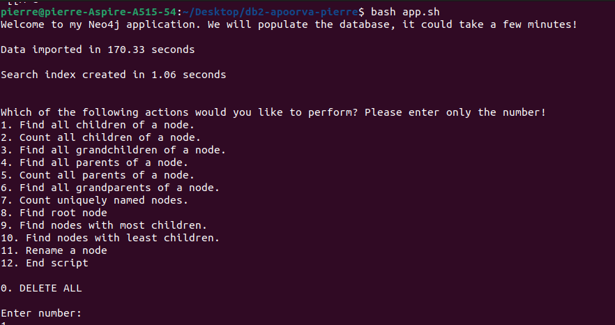

# Database Project 2022/2023 by Apoorva Singh, Pierre Rheeder

-------------

## Technology Stack and Project Design

The chosen technology for our project was Neo4J along with the APOC library. For the actual application we used a bash script which imports the data and creates relationships from the CSV file through cypher-shell commands. With Neo4J being a graph database, limited customisation is available for our design. We represent each category as a node in the graph and that node points to it's subcategories (children).  

-------------

## Implemenetation Process

The import query looks like this: 

```cypher
CREATE CONSTRAINT import_constraint ON (c:Category) ASSERT c.Name IS UNIQUE;

CALL apoc.periodic.iterate(
  'LOAD CSV FROM "file:///taxonomy_iw.csv" AS line RETURN line',
  'WITH line[0] AS cat1Name, line[1] AS cat2Name
   MERGE (n:Category {Name: cat1Name})
   MERGE (m:Category {Name: cat2Name})
   MERGE (n)-[:Super_Category]->(m)',
  {batchSize: 500, parallel: true}
)
```

We are first creating a constraint to ensure that names are unique. This helps speed up the import and also avoids duplicates.

Then using the APOC library we are calling the command with a batch of 500 lines of the CSV at at a time and doing this in parallel. This reduces load on the memory and helps import the data much faster. Without this we were importing the data at a rate of 12 hours and now it can be done in a couple of minutes.  

We were placing the queries for the data import and index creation in seperate .cyp files which would be called in the app.sh script, but for the actual goals we were just calling them within the script. All 11 goals were done with as shown in the code below:  

```bash
if [[ "$action" == 1 || "$action" == 2 || "$action" == 3 || "$action" == 4 || "$action" == 5 || "$action" == 6 || "$action" == 11 ]]; then
		echo "Enter the node you would like to perform the action on:"
		read given

fi

if [[ "$action" == 1 ]]; then
		output=$(echo "MATCH (parent:Category {Name: '$given'})
		MATCH (parent)-[:Super_Category]->(child)
		RETURN child.Name;" | time -f "\nThe action took %e seconds and the answer is the following:\n" cypher-shell -u neo4j -p password)
		
		node_names=$(echo "$output" | awk 'NR>1 {gsub(/"/,"",$0); print $0}')
		echo "$node_names"
fi
```

Once the user has entered which goal they would like to execute we check if that goal requires a node to be chosen, the user will be asked for it with the first ```if``` statement. We then use presceding ```if``` statements to check which goal the user would like to commence with. Once we do that, we execute the cypher query and store the output in a variable which is then edit with an awk command to make it look more user-friendly. We are also using the ```time``` command included with ```bash``` to measure the execution time of the cypher query.


-------------

## Prerequisites

1. Linux computer with suffient memory and processing power, a stable wifi connection.

2. Make sure GNU bash 5.0+ is installed: ```bash --version``` or ```sudo apt-get install bash```


-------------

## Installation Guide

During the installation we will download and install the following software:

1. Neo4J 4.1
2. Curl
3. Cypher-shell
4. Java 11
5. APOC Library for Neo4J

If you already have these installed please read through the short install.sh script to make sure it will not affect current environments.

**Steps for installation:**  

1. Run the install.sh file with the following command while in the project directory: ```sudo bash install.sh.``` 
This will install Neo4J and its dependencies and start the Neo4J server.  

2. Enter the following command once the Neo4J server has started: ```cypher-shell``` . The current username is 'neo4j' and password is 'neo4j'. It will start the shell and prompt you to change the password. Please change the password to 'password'.  

3. Now, while in the project directory, run the application by entering the following command: ```bash app.sh``` .

4. Wait for the database to load and choose the option from 0 to 12 you wish to execute, in order to evaluate the time taken and reproduce the Result section.


---------------

## Dependency Sources 


'apoc-4.1.0.0-all.jar'
https://github.com/neo4j-contrib/neo4j-apoc-procedures/releases/4.1.0.0   

taxonomy_iw.csv.gz
https://upel.agh.edu.pl/mod/page/view.php?id=116859 

Neo4j https://debian.neo4j.com/neotechnology.gpg.key https://debian.neo4j.com 

-------------

## Results

All tests were performed on an "Acer Aspire A515-54" with the following specifications:

CPU: Intel® Core™ i5-10210U CPU @ 1.60GHz × 8  
Memory: 16GB  
Storage: 1TB SSD  
OS: Ubuntu 22.04.2 LTS 64-bit  

To measure the time we are using the ```time``` command that is included with bash as shown in the introduction.  
  

| Goals | Execution time [s] |
|----------|----------|
|    Goal 1 |    1.03 |
|    Goal 2 |    0.84 |
|    Goal 3 |    1.06 |
|    Goal 4 |    0.85 |
|    Goal 5 |    1.02 |
|    Goal 6 |    0.87 |
|    Goal 7 |    2.40 |
|    Goal 8 |    0.99 |
|    Goal 9 |    4.35 |
|   Goal 10 |   3.89 |
|   Goal 11 |   0.88 |
|   Data Import |   170.33 |  

<br>

We are also including the screenshot below as proof of the data import execution time:  




-------------

## Self Evaluation


### Evaluation of Results 

- Overall all Project Objective Goals were met.
- The data Import time was reduced from 12 hours to an average of a few minutes, showing significant progress on the efficiency counter.
- Goal 8 and 9 takes the most time (Find nodes with the most children); however, ranking the top 10 adds to this time significantly. When only doing the top 1 Goal 9 was reduced down to 1.77 seconds from 4.35 seconds.
- Goal 2 and Goal 8 take the least amount of time (finding children and granparents of a node respectively).
- The results were reproduced successfully several times on two diffrent linux machine setups.
- The data import time can be dependent on the CPU of the machine used, as well as the current power settings. When placing my machine on "power saving mode" the times increased by about double due to the CPU limitations.


### Efficiency Improvement 

#### Speed Efficiency


The data import query was the most challenging part of this project. Using just a basic import query for Neo4J, it took upwards of 12 hours to import. Initially we were slowly reducing the times by adding constraints, indexes, periodic commits and other methods, but times were still taking over 5 hours. The big breakthrough was when the APOC library was discovered which gave access to a more efficient periodic commit including parallelism. This reduced the time to what it is currently with an under 3 minute import on the setup used for testing. This part of the project took up around 60% of our time invested into this project and consisted mostly of research and testing different import methods.

#### Set up Efficiency

The set up is arguably the most time consuming task prior to setting up the bash scripts a lot of problems were faced with the installation guide and technology usage, editing required files etc. Now the scripts provide a much smoother user experience.
As weeks passed of working on the project a lot of changes were made to the setup. Changing versions, adding libraries and so on. Problems are always faced during environment configuration, but the current scripts that have been setup up makes the user experience quite smooth. Almost everything is automated. 


### Current Shortcomings and Future Improvements

- We believe the import time can still be improved with further research.
- The terminal application could also be improved to offer a smoother user experience. Currently after results are displayed the whole options menu prints again, which isn't optimal.


-------------

## Roles of Students


### Pierre 
1. Designed import query.  
2. Setup queries.  
3. Bash scripts.  

### Apoorva Singh 
1. Installation documentation.  
2. Bash scripts.  
3. Import query research.  

-------------

<br>